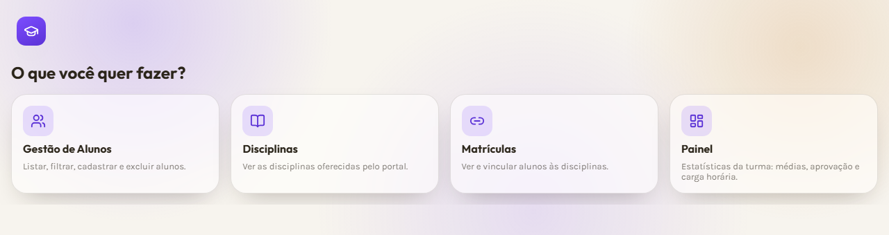

# Portal de Gestão Escolar — Frontend

Frontend do sistema de **gestão escolar**, em **React + TypeScript** (Vite).
Consome o mesmo contrato de dados da API de gestão escolar (FastAPI +
PostgreSQL) desenvolvida em
**[JhonneJrr/gestao-alunos](https://github.com/JhonneJrr/gestao-alunos)** —
hoje com dados mockados em `src/mock.ts`, prontos para virar `fetch` direto
na API real.



## O que tem

- **Tela de entrada** e **Home** com navegação simples entre funções (sem
  biblioteca de rotas — só estado do React).
- **Gestão de Alunos**: lista com busca por nome, filtros por idade e média
  mínimas (combináveis), cadastro controlado com validações, exclusão e
  tratamento de matrícula duplicada.
- **Disciplinas**: listagem das disciplinas do portal.
- **Matrículas**: consulta das disciplinas de um aluno e vínculo de um aluno
  a uma disciplina.
- **Painel**: indicadores da turma (total de alunos, média geral, disciplinas,
  carga horária) e a proporção de aprovados/reprovados.
- Tema próprio (vidro/glassmorphism, paleta violeta/âmbar), responsivo e com
  estados de carregando/erro/vazio em toda tela que busca dados.

## Início rápido

Com o Node.js 20.19+ instalado:

```bash
npm install     # baixa as dependências (uma vez)
npm run dev     # sobe o servidor de desenvolvimento
```

Abra o endereço mostrado (ex.: <http://localhost:5173>).

```bash
npm run build   # confere tipos (tsc) e gera a versão de produção
```

## Estrutura

```
.
├── index.html
├── src/
│   ├── main.tsx
│   ├── App.tsx              # dono da navegação entre telas
│   ├── types.ts             # interfaces dos dados (espelham o contrato da API)
│   ├── mock.ts               # dados de mentira
│   ├── api.ts                # fronteira com o backend (hoje mock, no futuro fetch)
│   ├── index.css
│   └── components/
│       ├── TelaEntry.tsx · TelaHome.tsx · CardFuncao.tsx · BotaoVoltar.tsx
│       ├── Cabecalho.tsx · PainelAlunos.tsx · Filtros.tsx · FormAluno.tsx
│       ├── ListaAlunos.tsx · AlunoCard.tsx
│       ├── TelaDisciplinas.tsx · DisciplinaCard.tsx
│       ├── TelaMatriculas.tsx
│       └── TelaDashboard.tsx
└── docs/
    ├── CONTRATO_API.md      # o formato dos dados
    └── DESAFIOS.md          # enunciado original do trabalho
```

**A arquitetura em uma frase:** os componentes chamam o `api.ts`; **só** o
`api.ts` conhece a origem dos dados — trocar o mock por `fetch` não muda
nenhum componente.

## Tecnologias

- [React 19](https://react.dev/) + [TypeScript](https://www.typescriptlang.org/)
- [Vite](https://vite.dev/)
- CSS puro (sem framework)
- Ícones [Lucide](https://lucide.dev/)
